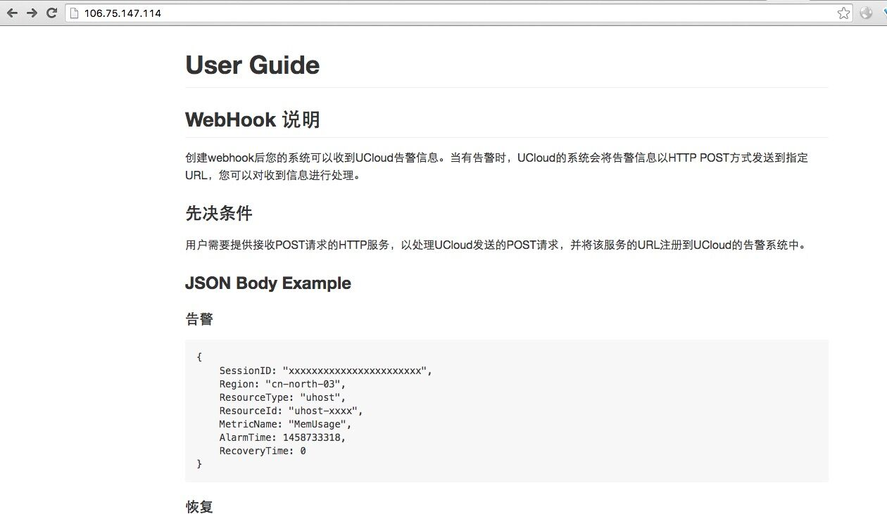

# User Guide

## WebHook 说明
创建webhook后您的系统可以收到UCloud告警信息。当有告警时，UCloud的系统会将告警信息以HTTP POST方式发送到指定URL，您可以对收到信息进行处理。

### 先决条件
用户需要提供接收POST请求的HTTP服务，以处理UCloud发送的POST请求，并将该服务的URL注册到UCloud的告警系统中。

### JSON Body Example
  
#### 告警
    {
        SessionID: "xxxxxxxxxxxxxxxxxxxxxxx",
        Region: "cn-north-03",
        ResourceType: "uhost",
        ResourceId: "uhost-xxxx",
        MetricName: "MemUsage",
        AlarmTime: 1458733318,
        RecoveryTime: 0
    }
  
#### 恢复
    {
        SessionID: "xxxxxxxxxxxxxxxxxxxxxxx",
        Region: "cn-north-03",
        ResourceType: "uhost",
        ResourceId: "uhost-xxxx",
        MetricName: "MemUsage",
        AlarmTime: 0,
        RecoveryTime: 1458733318
    }
  
**Field Explaination**
  

<table>
      <tr>
            <td>Field</td><td>Explaination</td>
      </tr>
      <tr>
            <td>SessionID</td><td>Session ID for this message</td>
      </tr>
      <tr>
            <td>Region</td><td>Region Name</td>
      </tr>
      <tr>
            <td>ResourceType</td><td>Resource Type</td>
      </tr>
      <tr>
            <td>ResourceId</td><td>short id</td>
      </tr>
      <tr>
            <td>MetricName</td><td>Metric Name for current warning</td>
      </tr>
      <tr>
            <td>AlarmTime</td><td>Alarm time</td>
      </tr>
      <tr>
            <td>RecoveryTime</td><td>Restory time</td>
      </tr>
      <tr>
            <td>Content</td><td>Warning content</td>
      </tr>
</table>

### Response
我们这边需要收到这样的response， 表明用户成功接收推送信息，否则会再重试2次：

    {
        SessionID: "xxxxxxxxxxxxxxxxxxxxxxx",
        RetCode: 0
    }

## WebHookServer Demo 编译、安装
本Demo提供实现支持WebHook服务的一种方式，基于Golang实现，使用MySQL存储收到的报警数据，Demo仅供参考。
下面以UHost及UDB为例介绍如何使用该Demo。

### 依赖外部环境
1. 根据UCloud相关操作说明创建系统为CentOS的UHost
        
        弹性IP
        106.75.49.79 BGP 2 Mb
        云硬盘
        外网防火墙
        Web服务器推荐(22，3389，80，443)

2. 根据UCloud相关操作说明创建UDB
        
        应用端口 3306
        用户名称 root
        配置文件 mysql5.6默认配置
        属性 master
        IP地址 10.10.99.159
        安全策略 内网隔离

### 准备工作
#### UHost
1. 安装Golang编译环境
        
        # yum install golang
        # mkdir /usr/local/golang
        # vim ~/.bashrc
        # cat ~/.bashrc
        # .bashrc

        # User specific aliases and functions

        alias rm='rm -i'
        alias cp='cp -i'
        alias mv='mv -i'

        # Source global definitions
        if [ -f /etc/bashrc ]; then
          . /etc/bashrc
        fi
        export HISTFILESIZE=100000
        export HISTTIMEFORMAT="%Y-%m-%d %H:%M:%S "

        export GOPATH=/usr/local/golang
        export PATH=$PATH:$GOPATH/bin
        # source ~/.bashrc
        
        # go env
        GOARCH="amd64"
        GOBIN=""
        GOEXE=""
        GOHOSTARCH="amd64"
        GOHOSTOS="linux"
        GOOS="linux"
        GOPATH="/usr/local/golang"
        GORACE=""
        GOROOT="/usr/lib/golang"
        GOTOOLDIR="/usr/lib/golang/pkg/tool/linux_amd64"
        GO15VENDOREXPERIMENT=""
        CC="gcc"
        GOGCCFLAGS="-fPIC -m64 -pthread -fmessage-length=0"
        CXX="g++"
        CGO_ENABLED="1"

2. 安装Golang第三方依赖包
        
        # yum install git
        # go get github.com/gorilla/mux
        # go get github.com/google/uuid
        # go get github.com/go-sql-driver/mysql

#### UDB
1. 登录先前创建的UDB
2. 创建Database
        
        CREATE DATABASE `monitor_warn`

3. 创建存储报警数据的Table,以下仅参考
        
        CREATE TABLE IF NOT EXISTS `warn_message` (
          `session_id` char(36) NOT NULL,
          `region` varchar(20) NOT NULL,
          `resource_type` varchar(45) NOT NULL,
          `resource_id` varchar(45) NOT NULL,
          `metric_name` varchar(50) NOT NULL,
          `alarm_time` int(11) DEFAULT NULL,
          `recovery_time` int(11) DEFAULT '0',
          PRIMARY KEY (`session_id`)
        ) ENGINE=InnoDB DEFAULT CHARSET=utf8;

### 编译
1. 上传webhookserver代码压缩包warn-webhook.zip，并解压
        
        # yum install unzip
        # rz -bey
        # unzip warn-webhook.zip

2. 在目录warn-webhook中创建名为src指向webhook-demo-go的软连接
        
        # cd warn-webhook
        # ln -s $PWD/webhook-demo-go src
        
2. 将目录warn-webhook添加到GOPATH
        
        # export GOPATH=$GOPATH:$PWD

3. 在目录webhook-demo-go中编译
        
        # cd webhook-demo-go/
        # go build -a .
        # ls
        doc  etc  restfulAPI  utils  webhook-demo-go  webhookserver.go

### 配置
1. 根据数据库表相关信息，修改webhook-demo-go/etc/conf.ini
        
        # vim etc/conf.ini
        # cat etc/conf.ini
        {
          "mysql-user": "root",
          "mysql-passwd": "passwd",
          "mysql-db": "monitor_warn",
          "mysql-host": "10.10.99.159",
          "mysql-port": 3306
        }

2. 执行编译生成的可执行程序webhook-demo-go，默认加载etc/conf.ini文件，也可以指定其他位置配置文件

        # ./webhook-demo-go [-c etc/conf.ini]
        2016/08/10 16:58:25 Welcome to ucloud monitor webhook demo ...
        2016/08/10 16:58:25 Monitor webhook demo use 2 process cores
        2016/08/10 16:58:25 Start monitor warn webhook server ...
        2016/08/10 16:58:25 Webhook Server listen on : :80

### 资源路径及接口
服务器启动时默认端口为80

1. / -> User Guide

2. /add -> 添加报警信息，即实际WebHook调用接口
3. /get -> 获取当前已经添加的报警信息

### 客户端说明
仅测试添加报警信息，实际数据请以接口实际返回为准，具体操作如下：

        # cd warn-webhook
        # go build ./webhook-client.go
        # ./webhook-client -u http://106.75.49.79/add    -> webhook post url
        Post request for webhook:  0
        {"SessionID":"07a89fb8-5ee0-11e6-b059-00ffbeabee13","Region":"cn-north-03","Reso
        urceType":"uhost","ResourceId":"uhost-xxxx","MetricName":"MemUsage","AlarmTime":
        1470822697,"RecoveryTime":0}
        ......

